# LinkedIn Booster

一个浏览器扩展，用于增强您的 LinkedIn 搜索体验，提取和分析搜索结果。

## 项目概述

LinkedIn Booster 是一个浏览器扩展，旨在帮助用户更高效地提取和处理 LinkedIn 搜索结果。该扩展通过浏览器侧边栏界面运行，为用户提供流畅的候选人数据管理和分析体验。

## 界面预览

```mermaid
flowchart TD
    subgraph 侧边栏
        direction TB
        style 侧边栏 fill:#ffffff,stroke:#e1e4e8,stroke-width:2px
        
        subgraph 标题栏
            direction LR
            style 标题栏 fill:#f6f8fa,stroke:#e1e4e8,stroke-width:1px
            title[LinkedIn Booster]
            style title fill:#f6f8fa,stroke:none,color:#24292e,font-weight:bold
        end
        
        subgraph 账户信息区
            direction TB
            style 账户信息区 fill:#ffffff,stroke:#e1e4e8,stroke-width:1px
            acc_title[账户信息]
            style acc_title fill:#ffffff,stroke:none,color:#24292e,font-weight:500
            acc_status[• 订阅状态]
            acc_token[• Token 余额]
            acc_date[• 下次扣款日期]
            style acc_status fill:#ffffff,stroke:none,color:#586069
            style acc_token fill:#ffffff,stroke:none,color:#586069
            style acc_date fill:#ffffff,stroke:none,color:#586069
        end
        
        subgraph 搜索结果区
            direction TB
            style 搜索结果区 fill:#ffffff,stroke:#e1e4e8,stroke-width:1px
            search_title[搜索结果列表]
            style search_title fill:#ffffff,stroke:none,color:#24292e,font-weight:500
            cand1[• 候选人 1]
            cand2[• 候选人 2]
            cand3[• 候选人 3]
            style cand1 fill:#ffffff,stroke:none,color:#586069
            style cand2 fill:#ffffff,stroke:none,color:#586069
            style cand3 fill:#ffffff,stroke:none,color:#586069
        end
        
        subgraph AI分析区
            direction TB
            style AI分析区 fill:#ffffff,stroke:#e1e4e8,stroke-width:1px
            ai_title[AI 分析区]
            style ai_title fill:#ffffff,stroke:none,color:#24292e,font-weight:500
            ai_eval[• 数据评估]
            ai_suggest[• 智能建议]
            style ai_eval fill:#ffffff,stroke:none,color:#586069
            style ai_suggest fill:#ffffff,stroke:none,color:#586069
        end
    end
```

## 主要功能

### 1. 账户管理
- 显示订阅状态
- 监控 Token 使用情况
- 查看账户余额
- 追踪即将到来的订阅付款

### 2. 搜索结果处理
- 从 LinkedIn 搜索结果中提取结构化数据
- 以组织化的列表展示候选人信息
- 支持导出结构化数据

### 3. AI 智能分析
- 交互式 AI 界面进行数据评估
- 处理和分析结构化候选人数据
- 智能洞察和建议

## 安装说明

1. 克隆代码仓库
2. 在浏览器中安装扩展
3. 配置 LinkedIn 账号信息

## 使用指南

1. 访问 LinkedIn 搜索页面
2. 打开扩展侧边栏
3. 开始提取和分析搜索结果

## 开发信息

本项目正在积极开发中，欢迎贡献代码！

## 许可证

[待添加许可证信息]

---

更多详细信息，请参考 `docs` 文件夹中的文档。
